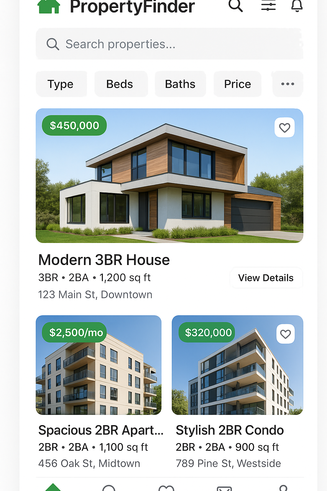
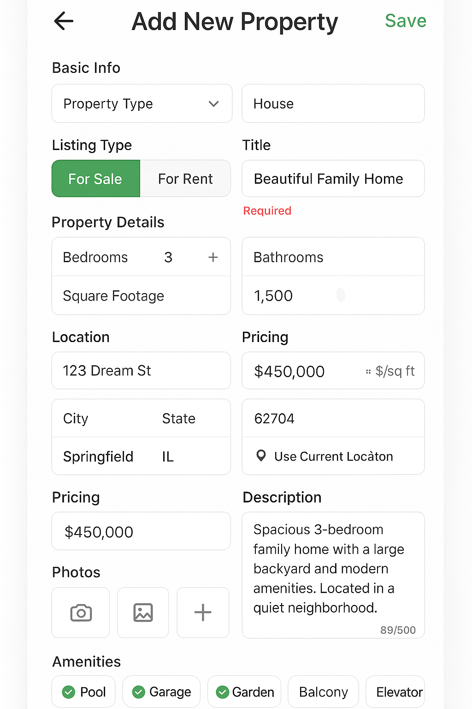

# Real Estate App
**App Name:** PropertyFinder  

## What the App Does

We want to make an app that helps people buy and sell properties easily. Users can:
- Look for properties to buy or rent
- Sell or rent their own properties
- Compare different properties
- Chat with sellers
- Find properties near them

## Main Features

### 1. User Account
- Sign up with email or phone
- Create a profile
- Save favorite properties
- Remember searches

### 2. Search for Properties
- Filter by:
  - Property type (house, apartment, condo, commercial)
  - Price range
  - Number of bedrooms/bathrooms
  - Square footage
  - Location
- Sort by price, size, or distance
- Save searches for later

### 3. Property Listings
- Show property details:
  - Property type, size, price
  - Photos (at least 5 pictures)
  - Number of bedrooms/bathrooms
  - Seller/landlord contact info
- Show seller/landlord ratings
- Compare multiple properties

### 4. Communication
- Chat with sellers
- Make phone calls
- Send messages
- Get notifications

### 5. List Your Property
- Easy form to list your property
- Upload photos
- Set your price/rent
- Manage your listings

### 6. Location Features
- Find properties near you
- Get directions to view properties
- Find nearby amenities

### 7. Property History
- Check property records
- See previous sales data
- Get property value estimates

### Security
- Keep user data safe
- Secure login
- Protect personal information

## User Flow

1. **Registration/Login** - Users sign up or log in to access the app
2. **Browse/Search** - Users browse property listings or search for specific properties
3. **View Details** - Users select a property to see detailed information
4. **Save Favorites** - Users can save properties to their favorites list
5. **Contact Seller** - Users can message sellers directly through the app

## Summary

Easy-to-use app for buying, selling, and renting properties. It will help people find the property they want and help sellers reach more buyers/renters.

## Domain Details

### Property Entity
The main entity representing real estate properties in the system with the following fields:

1. **propertyId** (String, Primary Key) - Unique identifier for each property listing
2. **propertyType** (String) - Type of property (House, Apartment, Condo, Commercial)
3. **title** (String) - Property title/name (e.g., "Modern 3BR House", "Downtown Apartment")
4. **bedrooms** (Integer) - Number of bedrooms
5. **bathrooms** (Decimal) - Number of bathrooms (can be half baths)
6. **price** (Decimal) - Asking price or rent in local currency
7. **squareFootage** (Integer) - Total square footage of the property
8. **condition** (String) - Property condition (Excellent, Good, Fair, Needs Work)
9. **listingType** (String) - For sale or for rent
10. **yearBuilt** (Integer) - Year the property was built
11. **description** (Text) - Detailed description of the property
12. **photos** (Array of URLs) - Links to property images
13. **address** (String) - Full property address
14. **city** (String) - City where property is located
15. **state** (String) - State/province where property is located
16. **zipCode** (String) - Postal/ZIP code
17. **sellerId** (String, Foreign Key) - Reference to the seller/landlord
18. **datePosted** (DateTime) - When the listing was created
19. **isActive** (Boolean) - Whether the listing is still available
20. **amenities** (Array of Strings) - Available amenities (pool, garage, etc.)

### User Entity
Represents app users (buyers, sellers, renters) with the following fields:

1. **userId** (String, Primary Key) - Unique identifier for each user
2. **email** (String) - User's email address for login
3. **phoneNumber** (String) - Contact phone number
4. **firstName** (String) - User's first name
5. **lastName** (String) - User's last name
6. **profilePicture** (String) - URL to user's profile photo
7. **location** (String) - User's city/area
8. **userType** (String) - Type of user (Buyer, Seller, Renter, Landlord, Agent)
9. **rating** (Decimal) - Average rating from other users
10. **totalRatings** (Integer) - Number of ratings received
11. **isVerified** (Boolean) - Whether user account is verified
12. **isAgent** (Boolean) - Whether user is a licensed real estate agent
13. **licenseNumber** (String) - Real estate license number (if applicable)
14. **dateJoined** (DateTime) - When user created account
15. **preferences** (JSON) - User's search and notification preferences

### Message Entity
Handles communication between users with the following fields:

1. **messageId** (String, Primary Key) - Unique identifier for each message
2. **senderId** (String, Foreign Key) - Reference to message sender
3. **receiverId** (String, Foreign Key) - Reference to message receiver
4. **propertyId** (String, Foreign Key) - Reference to the property being discussed
5. **content** (Text) - Message text content
6. **messageType** (String) - Type of message (text, image, offer, viewing_request)
7. **timestamp** (DateTime) - When message was sent
8. **isRead** (Boolean) - Whether message has been read
9. **isDeleted** (Boolean) - Whether message was deleted

### Favorite Entity
Tracks user's saved properties with the following fields:

1. **favoriteId** (String, Primary Key) - Unique identifier
2. **userId** (String, Foreign Key) - Reference to user
3. **propertyId** (String, Foreign Key) - Reference to saved property
4. **dateAdded** (DateTime) - When property was added to favorites
5. **notes** (Text) - User's personal notes about the property

## CRUD Operations

### Property Entity Operations

**CREATE (Add New Property Listing):**
- Users can create new property listings by filling out a detailed form
- Required fields: propertyType, title, bedrooms, bathrooms, price, squareFootage, address
- Optional fields: description, photos, yearBuilt, amenities, condition
- System validates data and assigns unique propertyId
- Listing becomes active immediately after creation

**READ (View Property Listings):**
- Users can browse all active property listings
- Filter by property type, bedrooms, bathrooms, price range, location, square footage
- Sort by price, size, date posted, or distance
- View detailed property information including photos and seller/landlord details
- Search functionality with keyword matching

**UPDATE (Modify Property Listing):**
- Sellers can edit their own property listings
- Can update price, description, photos, and availability status
- Cannot change core details like property type, bedrooms, bathrooms after posting
- Changes are reflected immediately in search results
- Edit history is maintained for transparency

**DELETE (Remove Property Listing):**
- Sellers can delete their own listings
- System marks listing as inactive rather than permanent deletion
- Deleted listings are removed from search results
- Associated messages and favorites are preserved for reference

### User Entity Operations

**CREATE (User Registration):**
- New users register with email and password
- Optional phone number and profile information
- System validates email format and password strength
- User account is created with default preferences

**READ (View User Profiles):**
- Users can view seller/landlord profiles when browsing properties
- Display user rating, location, verification status, and user type
- Show user's other listings and contact information
- Privacy settings control what information is visible

**UPDATE (Edit Profile):**
- Users can update their profile information
- Can change contact details, location, and preferences
- Profile picture and description can be modified
- Changes are reflected across all user's listings

**DELETE (Account Deletion):**
- Users can request account deletion
- All personal data is removed from the system
- User's car listings are marked as inactive
- Associated messages are anonymized

### Message Entity Operations

**CREATE (Send Message):**
- Users can send messages to property sellers
- Messages are linked to specific property listings
- Support for text messages, image attachments, and viewing requests
- Messages are delivered in real-time when possible

**READ (View Messages):**
- Users can view their message conversations
- Messages are organized by car listing
- Unread message indicators and timestamps
- Message history is preserved for reference

**UPDATE (Edit Message):**
- Users can edit unsent messages
- Sent messages cannot be modified
- Message status can be updated (read/unread)

**DELETE (Remove Messages):**
- Users can delete messages from their inbox
- Deleted messages are removed from user's view
- Messages remain visible to the other party
- System maintains message logs for moderation

## Persistence Details

### Local Database Storage (Offline Access)
The following operations are cached locally for offline functionality:

1. **Property Listings (READ)** - Recently viewed property listings are stored locally
2. **User Profile (READ/UPDATE)** - Current user's profile data is cached
3. **Favorites (CREATE/READ/DELETE)** - User's favorite properties are stored locally
4. **Messages (CREATE/READ)** - Recent messages are cached for offline viewing
5. **Search History (CREATE/READ)** - Previous searches are stored locally

### Server Database Storage (Online Operations)
The following operations require server connectivity:

1. **Property Listings (CREATE/UPDATE/DELETE)** - All property listing modifications
2. **User Registration (CREATE)** - New user account creation
3. **Message Sending (CREATE)** - Sending new messages to other users
4. **Search Operations (READ)** - Advanced search and filtering
5. **User Authentication (READ)** - Login and session management
6. **Rating System (CREATE/UPDATE)** - User ratings and reviews

## Offline Access Scenarios

### CREATE Operations Offline

**Property Listing Creation:**
- Users can fill out the property listing form offline
- Form data is saved locally as a draft
- When connection is restored, draft is automatically submitted
- User receives confirmation when listing is successfully posted

**Message Composition:**
- Users can compose messages offline
- Messages are queued locally for sending
- Automatic retry when connection is available
- User is notified when messages are successfully sent

**Adding Favorites:**
- Users can add properties to favorites while offline
- Favorites are stored locally immediately
- Sync with server occurs when connection is restored

### READ Operations Offline

**Viewing Cached Property Listings:**
- Recently viewed property listings remain accessible offline
- Full property details including photos are available
- User can browse through cached listings
- "Last updated" timestamps show data freshness

**Accessing User Profile:**
- User's own profile information is available offline
- Can view and edit profile details
- Changes are queued for server sync

**Reading Messages:**
- Recent message conversations are accessible offline
- Can view message history and read received messages
- New messages are queued for sending when online

### UPDATE Operations Offline

**Editing Property Listings:**
- Sellers can modify their listings offline
- Changes are saved locally as pending updates
- Automatic sync when connection is restored
- Conflict resolution handles simultaneous edits

**Profile Updates:**
- Users can update their profile information offline
- Changes are queued for server synchronization
- Local changes are immediately visible in the app

### DELETE Operations Offline

**Removing Favorites:**
- Users can remove properties from favorites offline
- Changes are applied locally immediately
- Server sync occurs when connection is available

**Deleting Messages:**
- Users can delete messages from their view offline
- Deletions are queued for server synchronization
- Local message list is updated immediately

## Mockup Screenshots

 
